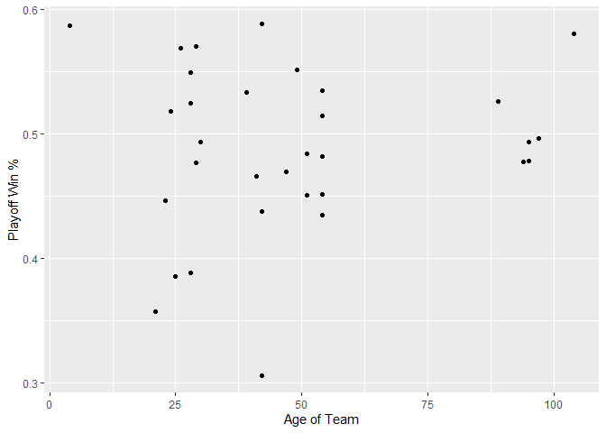
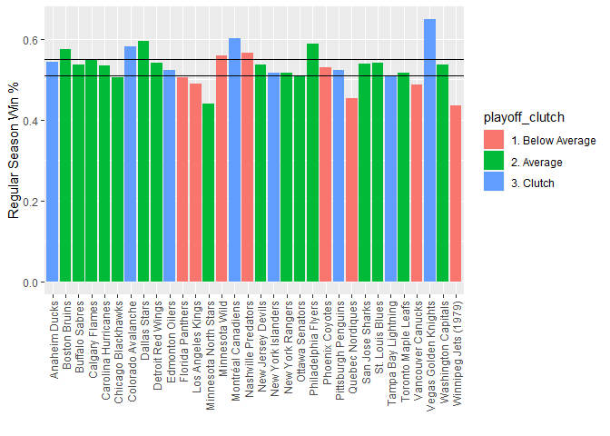
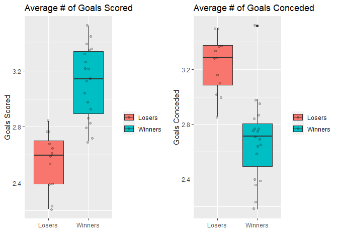
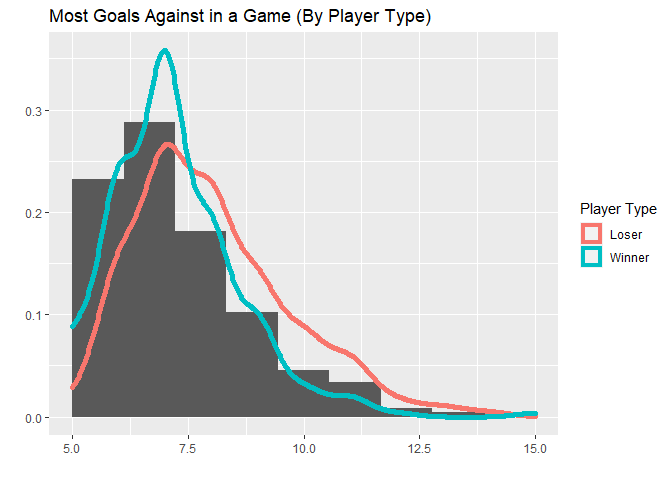

ST558-651 Project 1
================

-   [Set Up Data Scrape](#set-up-data-scrape)
    -   [Base links](#base-links)
    -   [Get List of Teams](#get-list-of-teams)
    -   [Check Team ID](#check-team-id)
-   [Functions](#functions)
    -   [Record Functions](#record-functions)
    -   [Stat Functions](#stat-functions)
    -   [Wrapper Function](#wrapper-function)
    -   [Misc Functions](#misc-functions)
-   [Summarizing](#summarizing)
    -   [Contingency Tables](#contingency-tables)
    -   [Playoff Win % by Team Age](#playoff-win--by-team-age)
    -   [Regular Season % and Playoff %](#regular-season--and-playoff-)
    -   [Analyzing Wins](#analyzing-wins)

## Set Up Data Scrape

### Base links

These are the base links to the two main APIs.

``` r
base_records <- 'https://records.nhl.com/site/api'
base_stats <- 'https://statsapi.web.nhl.com/api/v1/'
```

### Get List of Teams

Grabs the list of teams from the Records API.

``` r
url <- paste0(base_records, '/franchise')
teams <- tibble(jsonlite::fromJSON(url, flatten=TRUE)$data)
```

### Check Team ID

Here we check the team ID to verify it is valid and also convert names
to the ID. Also, we provide the ability to convert the franchise ID over
to the most recent team ID.

``` r
get_valid_id <- function(id) {
  if (is.null(id)) {
    return (NULL)
  }
  #check that the id provided is legit
  if (is.numeric(id) & !(id %in% teams$id)) {
    print('ID provided is not a valid team ID')
    return (NULL)
  }
  
  #check that abbreviation provided is legit
  if (!is.numeric(id) & !(id %in% teams$teamAbbrev)) {
    print('Team abbrevation provided is not a valid team name')
    return (NULL)
  } else if (!is.numeric(id)) {
    id <- teams$id[which(teams$teamAbbrev == id)]
  }
  
  return (id)
}

#This function takes in the franchise ID and converts it 
#to the most recent team ID
convert_to_recentId <- function(id) {
  #at this point we have gone through the valid ID funciton 
  #so this should be passed a valid franchise ID
  #return the most recent team ID
  return(teams$mostRecentTeamId[which(teams$id == id)])
}
```

## Functions

### Record Functions

This chunk of code creates all of the functions to query the records
API. There is a function for: \* Getting the franchises \* Getting the
totals for each team \* Getting season records for each team \* Goalie
Data \* Skater data \* Franchise details

``` r
get_franchises <- function(){
  url <- paste0(base_records, '/franchise')
  tibble(jsonlite::fromJSON(url, flatten=TRUE)$data)
}

get_franchise_team_totals <- function(){
  url <- paste0(base_records, '/franchise-team-totals')
  tibble(jsonlite::fromJSON(url, flatten=TRUE)$data)
}

get_franchise_season_records <- function(id){
  
  id <- get_valid_id(id)
  #if id returns as null then the value passed was incorrect
  if (is.null(id)) {
    return(NULL)
  }
  
  url <- paste0(base_records,
          '/franchise-season-records?cayenneExp=franchiseId=',
          id)
  return (tibble(jsonlite::fromJSON(url, flatten=TRUE)$data))
}


get_franchise_goalie_records <- function(id) {
  id <- get_valid_id(id)
  #if id returns as null then the value passed was incorrect
  url <- paste0(base_records, '/franchise-goalie-records')
  if (!is.null(id)) {
    url <- paste0(url, '?cayenneExp=franchiseId=', id)
  }
  
  return (tibble(jsonlite::fromJSON(url, flatten=TRUE)$data))
}

get_franchise_skater_records <- function(id) {
  id <- get_valid_id(id)
  #if id returns as null then the value passed was incorrect
  url <- paste0(base_records, '/franchise-skater-records')
  if (!is.null(id)) {
    url <- paste0(url, '?cayenneExp=franchiseId=', id)
  }
  
  return (tibble(jsonlite::fromJSON(url, flatten=TRUE)$data))
}

get_franchise_details <- function(id) {
  id <- get_valid_id(id)
  #if id returns as null then the value passed was incorrect
  if (is.null(id)) {
    print('ID provided was not a valid team ID')
    return(NULL)
  }
  #change franchise id to mostRecentTeamId
  id <- convert_to_recentId(id)
  
  url <- paste0(base_records,
          '/franchise-detail?cayenneExp=mostRecentTeamId=',
          id)
  return (tibble(jsonlite::fromJSON(url)$data))
}
```

### Stat Functions

There is one function in this chunk of code that queries the stats API
for team stats.

``` r
get_team_stats <- function(id=NULL) {
  url <- paste0(base_stats, 'teams/')
  #if id is null, it will return null
  #if id is bad, it will return null
  id <- get_valid_id(id)
  
  #if id is not null, put it in the url
  if (!is.null(id)) {
    url <- paste0(url,'/', id, '/')
  }
  
  url <- paste0(url, '?expand=team.stats')
  
  #the stat columns all return as character. convert them to numeric
  all_stats <- tibble(jsonlite::fromJSON(url, flatten=TRUE)$teams) %>%
                      unnest(teamStats) %>% 
                      unnest(splits) %>% drop_na(stat.gamesPlayed)
  stats2 <- all_stats %>% select(starts_with('stat')) %>%
                  mutate_if(is.character,as.numeric)
  stats1 <- all_stats %>% select(!starts_with('stat'))
  total_stats <- tibble(cbind(stats1, stats2))
  return (total_stats)
}
```

### Wrapper Function

This wrapper function allows the user to query any of the functions
through this one function and returns a tibble of the data. The only
requirement is for the user to pass the stat type and an ID if necessary
for that particular API call.

``` r
get_nhl_data <- function(stat_type, id=NULL) {
  if (stat_type == 'Franchises') {
    return(get_franchises())
  } else if (stat_type == 'Totals') {
    return(get_franchise_team_totals())
  } else if (stat_type == 'Records') {
    return(get_franchise_season_records(id))
  } else if (stat_type == 'Goalies') {
    return(get_franchise_goalie_records(id))
  } else if (stat_type == 'Skaters') {
    return(get_franchise_skater_records(id))
  } else if (stat_type == 'Details') {
    return(get_franchise_details(id))
  } else if (stat_type == 'Team Stats') {
    return(get_team_stats(id))
  }
  
}
```

### Misc Functions

The ‘First Year’ variable is two numeric years appended together. This
function strips out the first season year and returns it. The function
must be supplied with a numeric vector of years from the NHL data.

``` r
extract_year <- function(data) {
  #confirm numeric vector
  if (!(is.vector(data) & is.numeric(data))) {
    print('You must provide a numeric vector of years')
    return (NULL)
  }
  
  convert <- tryCatch(
           strtoi(substr(data, 1, 4), 0L),
           error = function(e)
           print("You must pass a numeric vector of years"))
}
```

## Summarizing

### Contingency Tables

Let’s look at skaters and goalies. I am grabbing all here, but you can
pass a franchise ID or team abbreviation as well to get skaters from
specific franchises. I wanted to look at the skaters’ stats by win/loss,
but that metric is not readily available, so instead the tables will be
based on position.

Luckily, goalies do have a win/loss stat, so they were further
categorized as “winners” and “losers” (harsh I know). In both cases, we
only looked at players who had 50 or more games played.

``` r
skaters <- get_nhl_data('Skaters') %>% 
              filter(gamesPlayed >= 50) %>%
              group_by(positionCode) %>%
              summarise(Goals = sum(goals),
                        Assists = sum(assists),
                        Points = sum(points),
                        PenaltyMinutes = sum(penaltyMinutes))
goalies <- get_nhl_data('Goalies') %>% drop_na(mostSavesOneGame,
                                                mostShotsAgainstOneGame) %>%
              filter(gamesPlayed >= 50) %>%
              mutate(player_type = if_else(wins >= losses
                                           , 'Winner', 'Loser')) %>%
              group_by(player_type) %>%
              summarise(MostGoals = mean(mostGoalsAgainstOneGame),
                        MostSaves = mean(mostSavesOneGame),
                        MostShots = mean(mostShotsAgainstOneGame),
                        MostShutouts = mean(mostShutoutsOneSeason),
                        mostWins = mean(mostWinsOneSeason))
```

The summary of skaters data was mostly unsurprising. Centers scored the
most goals, with wings being behind them. I suppose for someone like me
who is not an expert in hockey, it is surprising to see that defensive
players tended to score more points overall due to more assists than
wings. And of course, the penalty minutes for defensive players is
laughably higher than the other positions.

| positionCode |  Goals | Assists | Points | PenaltyMinutes |
|:-------------|-------:|--------:|-------:|---------------:|
| C            | 113915 |  175892 | 289807 |         290619 |
| D            |  48024 |  159077 | 207101 |         607656 |
| L            |  86892 |  106939 | 193831 |         336769 |
| R            |  94441 |  114930 | 209371 |         326713 |

With goalies, unfortunately this data set does not have total goals,
shots, etc, but rather most in a game. I think it would be easier to
spot patterns with those types of averages, but with ‘most in a game’,
the summaries are much closer. Perhaps the one summary statistic that
still translates is the ‘Most Shutouts in a Season’ statistic. In this
case, it is intuitive that goalies who win more would have more
shutouts.

| player\_type | MostGoals | MostSaves | MostShots | MostShutouts | mostWins |
|:-------------|----------:|----------:|----------:|-------------:|---------:|
| Loser        |  8.000000 |  46.18994 |  49.94972 |     2.731844 | 17.98324 |
| Winner       |  7.194444 |  45.26190 |  48.28175 |     4.682540 | 28.20238 |

### Playoff Win % by Team Age

Here we are looking at the age of the team vs their playoff win
percentage.

``` r
#let's look at all franchises via franchise totals
data <- get_nhl_data('Totals')
data$first_season <- extract_year(data$firstSeasonId)
data$team_age <- 2021 - data$first_season

#let's look at active franchises first
#and pivot wider so that playoffs and reg season 
#are on the same line of data
franchises <- data %>%
                filter(activeFranchise == 1, gamesPlayed > 50, ) %>%
                mutate(game_type = if_else(gameTypeId == 2, 
                                           'regular', 'playoff')) %>%
                select(franchiseId, teamName, gamesPlayed, 
                       wins, losses, game_type, first_season, team_age) %>%
                pivot_wider(names_from = game_type, values_from = 
                              c(gamesPlayed, wins, losses)) %>%
                drop_na()


franchises$win_pct_playoff <- franchises$wins_playoff / 
                        (franchises$wins_playoff + franchises$losses_playoff)
franchises$win_pct_regular <- franchises$wins_regular / 
                        (franchises$wins_regular + franchises$losses_regular)

g <- ggplot(data=franchises, aes(x=team_age, y=win_pct_playoff)) +
      geom_point() + 
      xlab('Age of Team') + ylab('Playoff Win %')
g
```

<!-- -->

### Regular Season % and Playoff %

This chunk compares team’s regular season win percentages to their
playoff percentages. There are quantiles provided for the regular season
percentage, and the playoff win percentage was grouped into three
categories.

Interestingly, there are no teams that historically do not perform well
in the regular season that perform above average in the playoffs.
However, there are two teams that perform above average it the regular
season that perform below average in the playoffs (the Wild and the
Predators).

``` r
playoff_quantiles <- quantile(franchises$win_pct_playoff, 
                               c(0.25, 0.75), na.rm=TRUE)
regular_quantiles <- quantile(franchises$win_pct_regular,
                              c(0.25, 0.75, na.rm=TRUE))
franchises <- franchises %>% 
              mutate(playoff_clutch = 
                      if_else(win_pct_playoff <= playoff_quantiles[1],
                              '1. Below Average',
                      if_else(win_pct_playoff > playoff_quantiles[1] &
                              win_pct_playoff < playoff_quantiles[2],
                              '2. Average',
                              '3. Clutch')))

ggplot(data=franchises, aes(x=teamName, y=win_pct_regular)) +
  geom_col(aes(fill=playoff_clutch)) +
  theme(axis.text.x=element_text(angle=90,hjust=1,vjust=0.5)) +
  geom_hline(aes(yintercept = regular_quantiles[1])) +
  geom_hline(aes(yintercept = regular_quantiles[2])) +
  xlab('') + ylab('Regular Season Win %') +
  guides(fill=guide_legend(title="Playoff Clutch Rating"))
```

<!-- -->

### Analyzing Wins

Looking at overall team stats, again we break apart by “winners” and
“losers” to summarize the data.

``` r
all_stats <- get_nhl_data('Team Stats') %>%
                mutate(team_type = if_else(stat.wins >= stat.losses, 
                                           'Winners', 'Losers'))
```

#### Box plots

``` r
p1 <- ggplot(all_stats, aes(x=team_type, 
                           y=stat.goalsPerGame,
                           fill=team_type)) +
      geom_boxplot() + geom_jitter(width=0.1,alpha=0.2) +
      guides(fill=guide_legend(title="")) +
      ggtitle('Average # of Goals Scored') +
      xlab('') + ylab('Goals Scored')

p2 <- ggplot(all_stats, aes(x=team_type, 
                           y=stat.goalsAgainstPerGame,
                           fill=team_type)) +
      geom_boxplot() + geom_jitter(width=0.1,alpha=0.2) +
      guides(fill=guide_legend(title="")) +
      ggtitle('Average # of Goals Conceded') +
      xlab('') + ylab('Goals Conceded')
```

Though I expected there to be a difference to be winning and losing
teams, the difference is quite stark. Neither boxplot really intersects
the other for goals given up or scored.

``` r
grid.arrange(p1, p2, ncol=2)
```

<!-- -->

#### Histograms

Here we will do a histogram of goals given up by goalies, with a density
for each player type (winner or loser).

``` r
goalies <- get_nhl_data('Goalies') %>% drop_na(mostSavesOneGame,
                                                mostShotsAgainstOneGame) %>%
              filter(gamesPlayed >= 50) %>%
              mutate(player_type = if_else(wins >= losses
                                           , 'Winner', 'Loser'))

p <- ggplot(data=goalies, aes(x=mostGoalsAgainstOneGame)) +
        geom_histogram(aes(y=..density..), bins=10) +
        geom_density(aes(color=player_type), kernel='gaussian', size=2) +
        guides(fill=guide_legend(title="Player Type")) +
        ggtitle('Most Goals Against in a Game (By Player Type)') +
        guides(fill=guide_legend(title="Player Type")) +
        xlab('') + ylab('')
```

As we can see, most goalies have a worst game of around 6-7 goals. And
this is true for both “winner” and “loser” goalies - though by adding
the kernel over top, we can see that the winner goalies kernel is
slighly more right skewed and more centered on the 6-7 range.

``` r
grid.arrange(p)
```

<!-- -->
