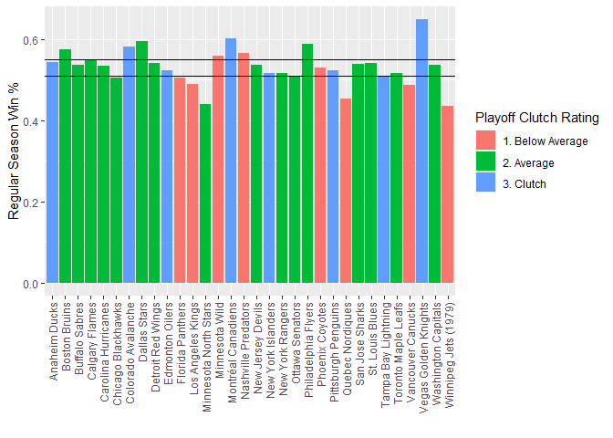

ST558-651 Project 1
================

-   [Set Up Data Scrape](#set-up-data-scrape)
    -   [Base links](#base-links)
    -   [Get List of Teams](#get-list-of-teams)
    -   [Check Team ID](#check-team-id)
-   [Functions](#functions)
    -   [Record Functions](#record-functions)
    -   [Stat Functions](#stat-functions)
    -   [Wrapper Function](#wrapper-function)
    -   [Misc Functions](#misc-functions)
-   [Summarizing](#summarizing)
    -   [Playoff Win % by Team Age](#playoff-win--by-team-age)
    -   [Regular Season % and Playoff %](#regular-season--and-playoff-)

## Set Up Data Scrape

### Base links

These are the base links to the two main APIs.

``` r
base_records <- 'https://records.nhl.com/site/api'
base_stats <- 'https://statsapi.web.nhl.com/api/v1/'
```

### Get List of Teams

Grabs the list of teams from the Records API.

``` r
url <- paste0(base_records, '/franchise')
teams <- tibble(jsonlite::fromJSON(url, flatten=TRUE)$data)
```

### Check Team ID

Here we check the team ID to verify it is valid and also convert names
to the ID. Also, we provide the ability to convert the franchise ID over
to the most recent team ID.

``` r
get_valid_id <- function(id) {
  if (is.null(id)) {
    return (NULL)
  }
  #check that the id provided is legit
  if (is.numeric(id) & !(id %in% teams$id)) {
    print('ID provided is not a valid team ID')
    return (NULL)
  }
  
  #check that abbreviation provided is legit
  if (!is.numeric(id) & !(id %in% teams$teamAbbrev)) {
    print('Team abbrevation provided is not a valid team name')
    return (NULL)
  } else if (!is.numeric(id)) {
    id <- teams$id[which(teams$teamAbbrev == id)]
  }
  
  return (id)
}

#This function takes in the franchise ID and converts it 
#to the most recent team ID
convert_to_recentId <- function(id) {
  #at this point we have gone through the valid ID funciton 
  #so this should be passed a valid franchise ID
  #return the most recent team ID
  return(teams$mostRecentTeamId[which(teams$id == id)])
}
```

## Functions

### Record Functions

This chunk of code creates all of the functions to query the records
API. There is a function for: \* Getting the franchises \* Getting the
totals for each team \* Getting season records for each team \* Goalie
Data \* Skater data \* Franchise details

``` r
get_franchises <- function(){
  url <- paste0(base_records, '/franchise')
  tibble(jsonlite::fromJSON(url, flatten=TRUE)$data)
}

get_franchise_team_totals <- function(){
  url <- paste0(base_records, '/franchise-team-totals')
  tibble(jsonlite::fromJSON(url, flatten=TRUE)$data)
}

get_franchise_season_records <- function(id){
  
  id <- get_valid_id(id)
  #if id returns as null then the value passed was incorrect
  if (is.null(id)) {
    return(NULL)
  }
  
  url <- paste0(base_records,
          '/franchise-season-records?cayenneExp=franchiseId=',
          id)
  return (tibble(jsonlite::fromJSON(url, flatten=TRUE)$data))
}


get_franchise_goalie_records <- function(id) {
  id <- get_valid_id(id)
  #if id returns as null then the value passed was incorrect
  if (is.null(id)) {
    return(NULL)
  }
  url <- paste0(base_records,
          '/franchise-goalie-records?cayenneExp=franchiseId=',
          id)
  return (tibble(jsonlite::fromJSON(url, flatten=TRUE)$data))
}

get_franchise_skater_records <- function(id) {
  id <- get_valid_id(id)
  #if id returns as null then the value passed was incorrect
  if (is.null(id)) {
    print('ID provided was not a valid team ID')
    return(NULL)
  }
  url <- paste0(base_records,
          '/franchise-skater-records?cayenneExp=franchiseId=',
          id)
  return (tibble(jsonlite::fromJSON(url, flatten=TRUE)$data))
}

get_franchise_details <- function(id) {
  id <- get_valid_id(id)
  #if id returns as null then the value passed was incorrect
  if (is.null(id)) {
    print('ID provided was not a valid team ID')
    return(NULL)
  }
  #change franchise id to mostRecentTeamId
  id <- convert_to_recentId(id)
  
  url <- paste0(base_records,
          '/franchise-detail?cayenneExp=mostRecentTeamId=',
          id)
  return (tibble(jsonlite::fromJSON(url)$data))
}
```

### Stat Functions

There is one function in this chunk of code that queries the stats API
for team stats.

``` r
get_team_stats <- function(id=NULL) {
  url <- paste0(base_stats, 'teams/')
  #if id is null, it will return null
  #if id is bad, it will return null
  id <- get_valid_id(id)
  
  #if id is not null, put it in the url
  if (!is.null(id)) {
    url <- paste0(url,'/', id, '/')
  }
  
  url <- paste0(url, '?expand=team.stats')
  return (tibble(jsonlite::fromJSON(url, flatten=TRUE)$teams) %>%
            unnest(teamStats) %>% unnest(splits))
}
```

### Wrapper Function

This wrapper function allows the user to query any of the functions
through this one function and returns a tibble of the data. The only
requirement is for the user to pass the stat type and an ID if necessary
for that particular API call.

``` r
get_nhl_data <- function(stat_type, id=NULL) {
  if (stat_type == 'Franchises') {
    return(get_franchises())
  } else if (stat_type == 'Franchise Totals') {
    return(get_franchise_team_totals())
  } else if (stat_type == 'Franchise Records') {
    return(get_franchise_season_records(id))
  } else if (stat_type == 'Franchise Goalie Records') {
    return(get_franchise_goalie_records(id))
  } else if (stat_type == 'Franchise Skater Records') {
    return(get_franchise_skater_records(id))
  } else if (stat_type == 'Franchise Details') {
    return(get_franchise_details(id))
  } else if (stat_type == 'Team Stats') {
    return(get_team_stats(id))
  }
  
}
```

### Misc Functions

The ‘First Year’ variable is two numeric years appended together. This
function strips out the first season year and returns it. The function
must be supplied with a numeric vector of years from the NHL data.

``` r
extract_year <- function(data) {
  #confirm numeric vector
  if (!(is.vector(data) & is.numeric(data))) {
    print('You must provide a numeric vector of years')
    return (NULL)
  }
  
  convert <- tryCatch(
           strtoi(substr(data, 1, 4), 0L),
           error = function(e)
           print("You must pass a numeric vector of years"))
}
```

## Summarizing

### Playoff Win % by Team Age

Here we are looking at the age of the team vs their playoff win
percentage.

``` r
#let's look at all franchises via franchise totals
data <- get_nhl_data('Franchise Totals')
data$first_season <- extract_year(data$firstSeasonId)
data$team_age <- 2021 - data$first_season

#let's look at active franchises first
#and pivot wider so that playoffs and reg season 
#are on the same line of data
franchises <- data %>%
                filter(activeFranchise == 1, gamesPlayed > 50, ) %>%
                mutate(game_type = if_else(gameTypeId == 2, 
                                           'regular', 'playoff')) %>%
                select(franchiseId, teamName, gamesPlayed, 
                       wins, losses, game_type, first_season, team_age) %>%
                pivot_wider(names_from = game_type, values_from = 
                              c(gamesPlayed, wins, losses)) %>%
                drop_na()


franchises$win_pct_playoff <- franchises$wins_playoff / 
                        (franchises$wins_playoff + franchises$losses_playoff)
franchises$win_pct_regular <- franchises$wins_regular / 
                        (franchises$wins_regular + franchises$losses_regular)

g <- ggplot(data=franchises, aes(x=team_age, y=win_pct_playoff)) +
      geom_point() + 
      xlab('Age of Team') + ylab('Playoff Win %')
g
```

<!-- -->

### Regular Season % and Playoff %

This chunk compares team’s regular season win percentages to their
playoff percentages. There are quantiles provided for the regular season
percentage, and the playoff win percentage was grouped into three
categories.

``` r
playoff_quantiles <- quantile(franchises$win_pct_playoff, 
                               c(0.25, 0.75), na.rm=TRUE)
regular_quantiles <- quantile(franchises$win_pct_regular,
                              c(0.25, 0.75, na.rm=TRUE))
franchises <- franchises %>% 
              mutate(playoff_clutch = 
                      if_else(win_pct_playoff <= playoff_quantiles[1],
                              '1. Below Average',
                      if_else(win_pct_playoff > playoff_quantiles[1] &
                              win_pct_playoff < playoff_quantiles[2],
                              '2. Average',
                              '3. Clutch')))

ggplot(data=franchises, aes(x=teamName, y=win_pct_regular)) +
  geom_col(aes(fill=playoff_clutch)) +
  theme(axis.text.x=element_text(angle=90,hjust=1,vjust=0.5)) +
  geom_hline(aes(yintercept = regular_quantiles[1])) +
  geom_hline(aes(yintercept = regular_quantiles[2])) +
  xlab('') + ylab('Regular Season Win %')
```

<!-- -->
