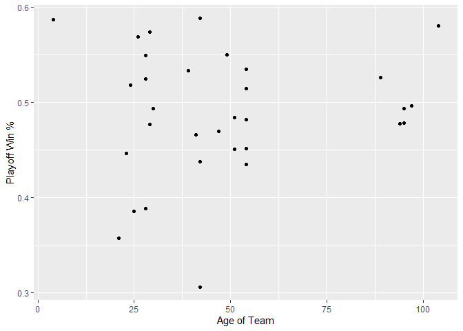
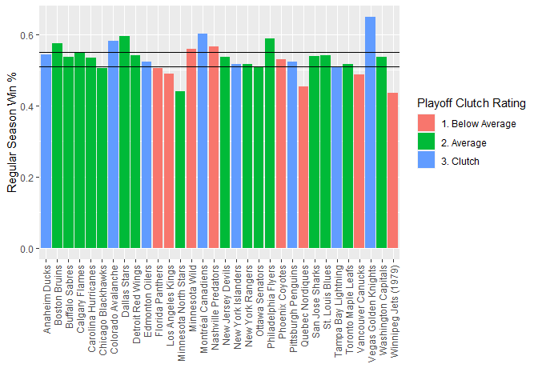

ST558-651 Project 1
================

-   [Set Up Data Scrape](#set-up-data-scrape)
    -   [Base links](#base-links)
    -   [Get List of Teams](#get-list-of-teams)
    -   [Check Team ID](#check-team-id)
-   [Functions](#functions)
    -   [Record Functions](#record-functions)
    -   [Stat Functions](#stat-functions)
    -   [Wrapper Function](#wrapper-function)
    -   [Misc Functions](#misc-functions)
-   [Summarizing](#summarizing)
    -   [Playoff Win % by Team Age](#playoff-win--by-team-age)
    -   [Regular Season % and Playoff %](#regular-season--and-playoff-)

## Set Up Data Scrape

### Base links

### Get List of Teams

### Check Team ID

## Functions

### Record Functions

### Stat Functions

### Wrapper Function

### Misc Functions

The ‘First Year’ variable is two numeric years appended together. This
function strips out the first season year and returns it. The function
must be supplied with a numeric vector of years from the NHL data.

``` r
extract_year <- function(data) {
  #confirm numeric vector
  if (!(is.vector(data) & is.numeric(data))) {
    print('You must provide a numeric vector of years')
    return (NULL)
  }
  
  convert <- tryCatch(
           strtoi(substr(data, 1, 4), 0L),
           error = function(e)
           print("You must pass a numeric vector of years"))
}
```

## Summarizing

### Playoff Win % by Team Age

``` r
#let's look at all franchises via franchise totals
data <- get_nhl_data('Franchise Totals')
data$first_season <- extract_year(data$firstSeasonId)
data$team_age <- 2021 - data$first_season

#let's look at active franchises first
#and pivot wider so that playoffs and reg season 
#are on the same line of data
franchises <- data %>%
                filter(activeFranchise == 1, gamesPlayed > 50, ) %>%
                mutate(game_type = if_else(gameTypeId == 2, 
                                           'regular', 'playoff')) %>%
                select(franchiseId, teamName, gamesPlayed, 
                       wins, losses, game_type, first_season, team_age) %>%
                pivot_wider(names_from = game_type, values_from = 
                              c(gamesPlayed, wins, losses)) %>%
                drop_na()


franchises$win_pct_playoff <- franchises$wins_playoff / 
                        (franchises$wins_playoff + franchises$losses_playoff)
franchises$win_pct_regular <- franchises$wins_regular / 
                        (franchises$wins_regular + franchises$losses_regular)

g <- ggplot(data=franchises, aes(x=team_age, y=win_pct_playoff)) +
      geom_point() + 
      xlab('Age of Team') + ylab('Playoff Win %')
g
```

<!-- -->

### Regular Season % and Playoff %

``` r
playoff_quantiles <- quantile(franchises$win_pct_playoff, 
                               c(0.25, 0.75), na.rm=TRUE)
regular_quantiles <- quantile(franchises$win_pct_regular,
                              c(0.25, 0.75, na.rm=TRUE))
franchises <- franchises %>% 
              mutate(playoff_clutch = 
                      if_else(win_pct_playoff <= playoff_quantiles[1],
                              '1. Below Average',
                      if_else(win_pct_playoff > playoff_quantiles[1] &
                              win_pct_playoff < playoff_quantiles[2],
                              '2. Average',
                              '3. Clutch')))

ggplot(data=franchises, aes(x=teamName, y=win_pct_regular)) +
  geom_col(aes(fill=playoff_clutch)) +
  theme(axis.text.x=element_text(angle=90,hjust=1,vjust=0.5)) +
  geom_hline(aes(yintercept = regular_quantiles[1])) +
  geom_hline(aes(yintercept = regular_quantiles[2])) +
  xlab('') + ylab('Regular Season Win %')
```

<!-- -->
